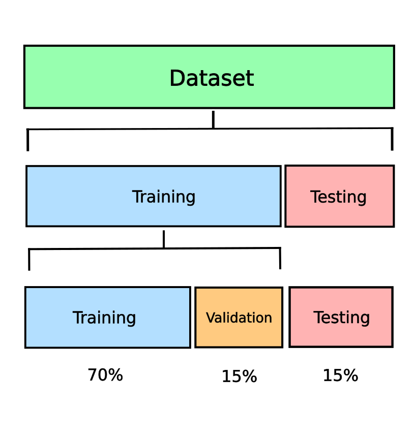
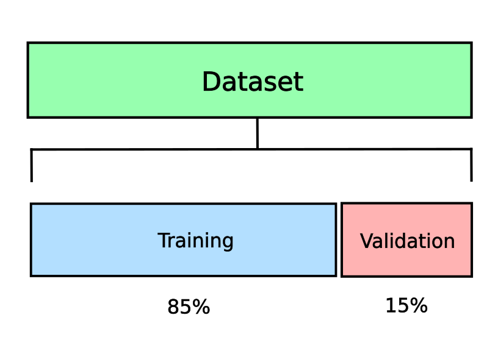

# Training, Validation, and Test Datasets - Machine Learning

## Definitions
- **Training Dataset**: The sample of data used to fit the model.
- **Validation Dataset**: The sample of data used to provide an unbiased evaluation of a model fit on the training dataset while tuning the model’s hyperparameters. 
    - Examples of the hyperparameters can be the number of hidden units, the layers and the layer widths in a neural network.
- **Test Dataset**: Also called the <u>validation dataset</u>, the sample of dataset that has not been used in training the model. It is used to provide an unbiased evaluation of a final model fit on the training dataset.
    - **Note**: The <u>test dataset</u> can be referred to as the <u>validation dataset</u> if the original data was partitioned into two subsets.

## Train-Test Split Evaluation
The **train-test split** is a method for evaluating the performance of a machine learning model.

The <u>train-test split procedure</u> involves taking a dataset and dividing it into the <u>training</u> and the <u>test</u> datasets.
- The first dataset is used to fit the model.
- The second dataset is not used to train the model and the input component of the dataset is provided to the model, then predictions are made and compared to the expected values.

## Advice on Model Evaluation
- The evaluation of the model score on the <u>training dataset</u> would result in a biased score. 
- The model must be evaluated on the held-out sample to result in an unbiased score of the model.
- It is important that the <u>final model evaluation</u> must be a held-out dataset that was not used for <u>training</u> the model or <u>tuning</u> the model parameters.

## Diagrams

Diagram of splitting the dataset into <u>training</u>, <u>testing</u>, and <u>validation</u> datasets:

Diagram of splitting the dataset into <u>training</u> and <u>validation</u> datasets:

## Resources
- Machine Learning Mastery
    - [What is the Difference Between Test and Validation Datasets?](https://machinelearningmastery.com/difference-test-validation-datasets/)
    - [Train-Test Split for Evaluating Machine Learning Algorithms](https://machinelearningmastery.com/train-test-split-for-evaluating-machine-learning-algorithms/)
- [How to Train and Test Data Like a Pro - Data Masters Club](https://sdsclub.com/how-to-train-and-test-data-like-a-pro/)
- [Training, validation, and test data sets - Wikipedia](https://en.wikipedia.org/wiki/Training%2C_validation%2C_and_test_data_sets) 
- ["Train, Validation, Test Split” explained in 200 words - Thaddeus Segura](https://thaddeus-segura.com/train-test-split/)
- [How To Do Train Test Split Using Sklearn In Python - GeeksforGeeks](https://www.geeksforgeeks.org/how-to-do-train-test-split-using-sklearn-in-python/)
- [Train Test Split – How to split data into train and test for validating machine learning models? - machinelearningplus](https://www.machinelearningplus.com/machine-learning/train-test-split/)
